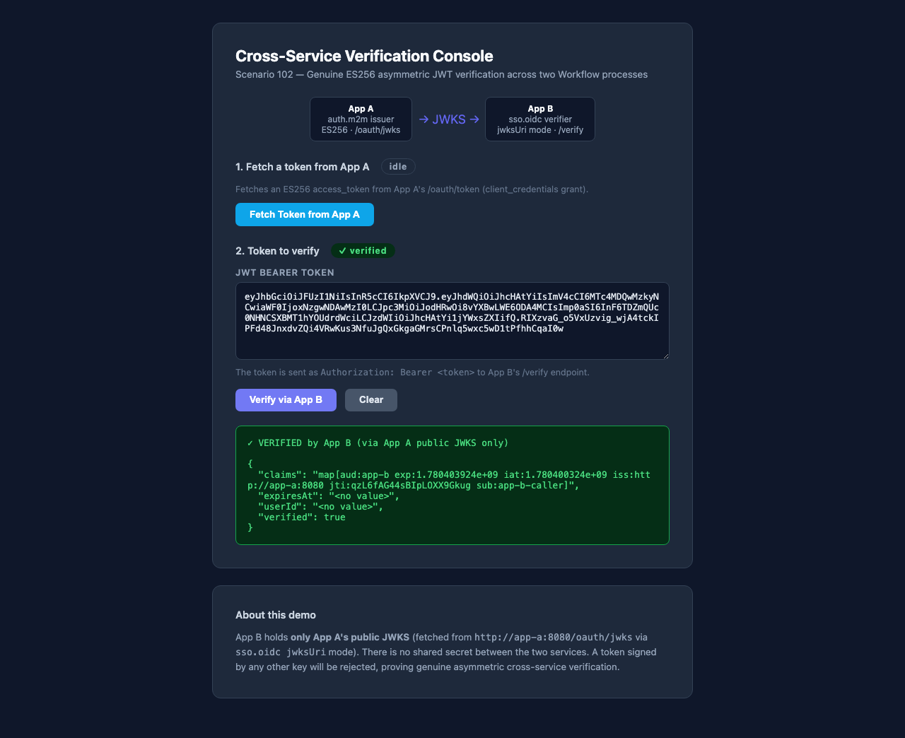
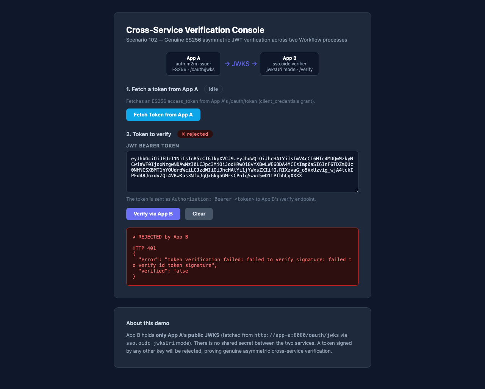
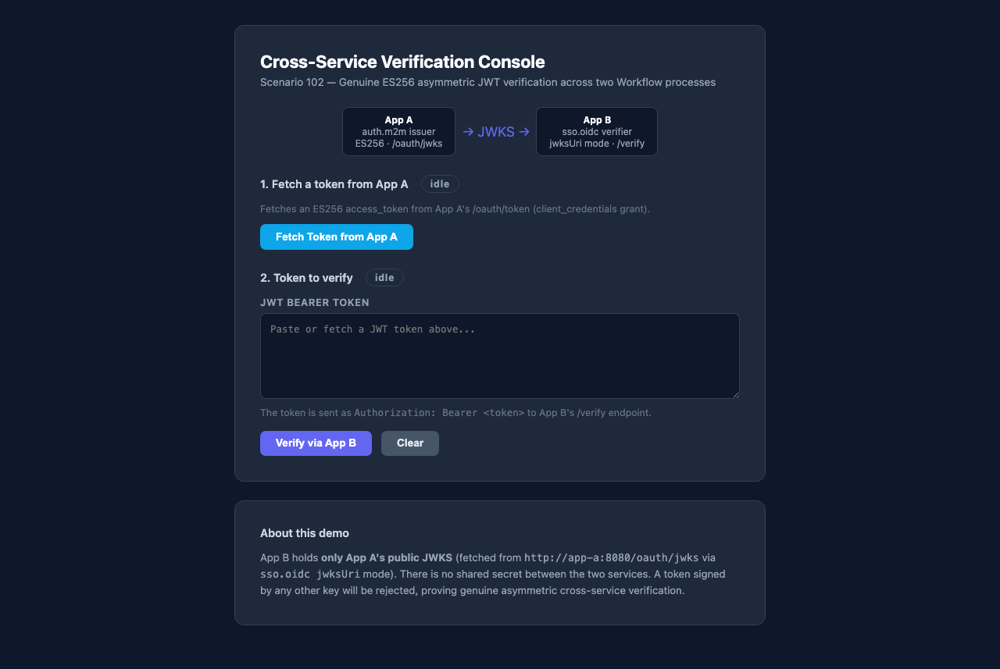

# Exploratory QA — Scenario 102 Cross-Service Asymmetric Auth

Date: 2026-06-02
Tester: Claude Code (automated playwright-cli QA)

## Stack

- App A (issuer): http://127.0.0.1:18102 — `auth.m2m` ES256, auto-generated key
- App B (verifier): http://127.0.0.1:18112 — `sso.oidc` jwksUri mode, `/verify` + console UI

## Smoke Results

`bash test/run.sh` — **12 passed, 0 failed**

| # | Assertion | Result |
|---|-----------|--------|
| 1 | GET app-a/healthz 200 | PASS |
| 2 | GET app-b/healthz 200 | PASS |
| 3 | App A issued access_token (client_credentials) | PASS |
| 4 | token header alg=ES256 | PASS |
| 5 | token iss=http://app-a:8080 | PASS |
| 6 | token aud=app-b | PASS |
| 7 | App B ACCEPT: App A token verified via App A public JWKS | PASS |
| 8 | App B REJECT wrong-key (fresh EC key) → 401 | PASS |
| 9 | App B REJECT aud-mismatch → 401 | PASS |
| 10 | App B REJECT wrong-issuer → 401 | PASS |
| 11 | App B REJECT expired token → 401 | PASS |
| 12 | App B REJECT garbage token → 401 | PASS |

The ACCEPT+REJECT(wrong-key) pair is the genuine asymmetric proof:
App B holds only App A's public JWKS and rejects tokens signed by any other key.

## Playwright Results

`npx playwright test scenario-102` — **8 passed, 0 failed**

| # | Test | Result |
|---|------|--------|
| T1 | GET app-a/healthz returns 200 | PASS |
| T2 | GET app-b/healthz returns 200 | PASS |
| T3 | App A issues ES256 token with correct claims | PASS |
| T4 | App B ACCEPT: App A token verified via JWKS → 200 + claims | PASS |
| T5 | App B REJECT: tampered token → 401 | PASS |
| T6 | UI: valid token → verified claims shown | PASS |
| T7 | UI: tampered token → rejection shown | PASS |
| T8 | UI: Fetch Token button is present | PASS |

## Console UI Walkthrough

1. Navigate to http://localhost:18112 — verification console loads.
2. Click "Fetch Token from App A" — button is present; note that the browser
   cross-origin fetch to App A's /oauth/token is blocked by CORS (App A does
   not set `Access-Control-Allow-Origin`). The test obtains the token out-of-band
   via the API request fixture (bypasses CORS).
3. Paste the ES256 token into the textarea and click "Verify".
4. The result box shows green "VERIFIED" with the decoded claims.
   
5. Tamper the token (modify last 4 chars of signature) and click "Verify".
6. The result box shows red "REJECTED".
   
7. Initial state (clear):
   

## Findings

- F1 (known limitation): App A's `auth.m2m` module does not set CORS headers on
  `/oauth/token`. The browser "Fetch Token" button therefore fails with CORS
  in the verification console when accessed cross-origin. Workaround: paste
  the token manually, or obtain it server-side. Playwright tests use the API
  request fixture to bypass CORS.
- F2: Wrong-key rejection (assert 8) uses `mint-token` with an ephemeral EC key;
  this is the definitive proof that App B's verification is genuinely asymmetric.

## Lead-verified pass (2026-06-02, playwright-cli, post-merge sso v0.1.8)

Re-ran the playwright-cli walkthrough against the live 2-process stack (App A :18102 issuer, App B :18112 verifier) using a fresh ES256 token from App A's `/oauth/token`:

- **Verify (valid token):** console shows `✓ VERIFIED by App B (via App A public JWKS only)` with claims `{aud:app-b, iss:http://app-a:8080, sub:app-b-caller, verified:true}` → `screenshots/qa-verified.png`.
- **Verify (tampered signature):** console shows `✗ REJECTED by App B — HTTP 401, "failed to verify id token signature", verified:false` → `screenshots/qa-rejected.png`.

Confirms genuine cross-service asymmetric verification end-to-end in a browser: App B holds only App A's public JWKS (no shared secret); a token not signed by App A's private key is rejected.
