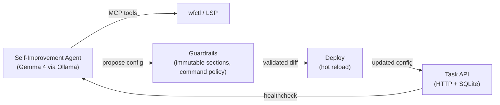

# Scenario 85 — Self-Improving API

An AI agent autonomously improves a task CRUD API using the workflow
self-improvement loop with Ollama + Gemma 4, guardrails, and MCP tools.

## Overview

The agent starts with a simple SQLite-backed task API and iteratively improves it:

1. **FTS5 full-text search** with BM25 ranking (custom Yaegi module)
2. **Cursor-based pagination** for the list endpoint
3. **Rate limiting per IP** to protect the API
4. **Structured JSON logging** with response times

## Architecture



## Self-Improvement Loop

```
load_config → designer (LLM + MCP tools) → blackboard_post
→ self_improve_validate → self_improve_diff → self_improve_deploy
```

Each iteration is committed to a local git repo so progress can be audited.

## Running

```bash
# Pull Gemma 4 and start all services
make up

# Stream logs
make logs

# Run tests (short — config validation only)
make test-short

# Run full e2e (requires Docker + Ollama + GPU)
make test
```

## Config Files

| File | Purpose |
|------|---------|
| `config/base-app.yaml` | Starting point: 5-endpoint task CRUD API |
| `config/agent-config.yaml` | Agent provider, guardrails, improvement pipeline |

## Guardrails

- **Immutable sections:** `modules.guardrails` cannot be modified without a challenge token
- **Command policy:** allowlist mode — only `go build`, `go test`, `wfctl`, `curl` permitted
- **Blocked:** pipe-to-shell (`curl ... | bash`), script execution, static analysis on all commands
- **Tool scope:** agent limited to `mcp:wfctl:*` and `mcp:lsp:*` namespaces

## Tests

```bash
make test-config      # Config validation (wfctl validate)
make test-guardrails  # Guardrails config checks
make test-short       # All tests with -short (skip Docker)
make test             # Full e2e (requires running Docker stack)
```
