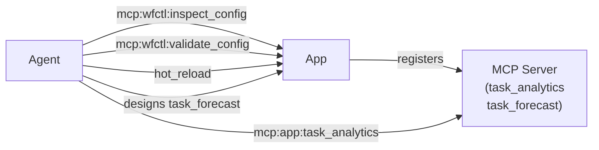

# Scenario 86 — Self-Extending MCP Tooling

An AI agent (Ollama + Gemma 4) that creates new MCP tools as workflow pipelines, then uses those tools to analyze data and create additional tools iteratively.

## What It Tests

- `mcp_tool` trigger type — pipeline exposed as an MCP tool
- `mcp:self_improve:*` permission scope for tool creation
- Guardrails enforcement during MCP tool creation
- Two-iteration tool chain: `task_analytics` → `task_forecast`
- Blackboard artifact tracking across iterations

## Architecture



## Quick Start

```bash
make up
make pull-model   # pulls gemma4 (~5GB, one-time)
make logs         # watch agent create the tools
make test         # config validation tests
make test-e2e     # full end-to-end test
```

## Seed Data

52 task records across 5 statuses:
- 21 `done` (≈40% completion rate)
- 10 `in_progress`
- 8 `blocked` (the bottleneck — most stuck tasks)
- 8 `review`
- 5 `pending`

The agent discovers this via `task_analytics` and uses the insight to design `task_forecast`.

## Agent Goal

1. Create `task_analytics` pipeline with `mcp_tool` trigger
2. Call `mcp:app:task_analytics` — get completion rate, avg time, bottleneck
3. Create `task_forecast` pipeline — 7-day moving average projection
4. Deploy both tools; verify both are callable via MCP

## Key Difference from Scenario 85

Scenario 85 modifies an existing application's config (self-improvement).
Scenario 86 extends the application's *interface* by adding new MCP-exposed tools (self-extension).

## Model Compatibility Notes

- `qwen2.5:7b` — stable, recommended for local testing
- `gemma4:e2b` — OOM crashes on iteration 2+; use qwen2.5:7b as fallback
- Task prompts must use explicit JSON format (`{"path": "..."}`) to prevent tool name hallucination
- `allowed_tools` must include `"mcp_wfctl__*"` — MCP tools register as `mcp_wfctl__<name>` at runtime
