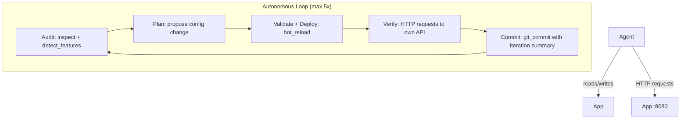

# Scenario 87 — Autonomous Agile Agent

An AI agent (Ollama + Gemma 4) that acts as an autonomous agile team: auditing the application, planning improvements, deploying them, and verifying with real HTTP requests — up to 5 times.

## What It Tests

- Full autonomous iteration loop: audit → plan → validate → deploy → verify → commit
- Agent hits its own API via HTTP to verify each deployment
- `mcp:wfctl:detect_project_features` for capability auditing
- `mcp:wfctl:api_extract` to maintain an up-to-date OpenAPI spec
- Git commit per iteration with meaningful messages
- Blackboard artifacts for all four phases of each iteration

## Architecture



## Quick Start

```bash
make up
make pull-model   # pulls gemma4 (~5GB, one-time)
make logs         # watch the agent iterate
make git-log      # see iteration commits inside container
make test         # config validation tests
make test-e2e     # full end-to-end test
```

## Key Difference from Earlier Scenarios

| Scenario | Agent Type |
|----------|-----------|
| 85 | Self-improves in response to a specific goal |
| 86 | Extends interface by creating new MCP tools |
| 87 | Fully autonomous — audits, decides, iterates, verifies without a human-defined goal beyond "production-ready" |

## Model Compatibility Notes

- `qwen2.5:7b` — stable, recommended for local testing
- `gemma4:e2b` — OOM crashes on iteration 2+; use qwen2.5:7b as fallback
- Task prompts must use explicit JSON format (`{"path": "..."}`) to prevent tool name hallucination
- `allowed_tools` must include `"mcp_wfctl__*"` — MCP tools register as `mcp_wfctl__<name>` at runtime
